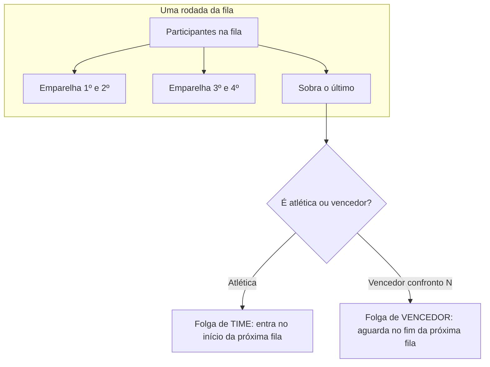
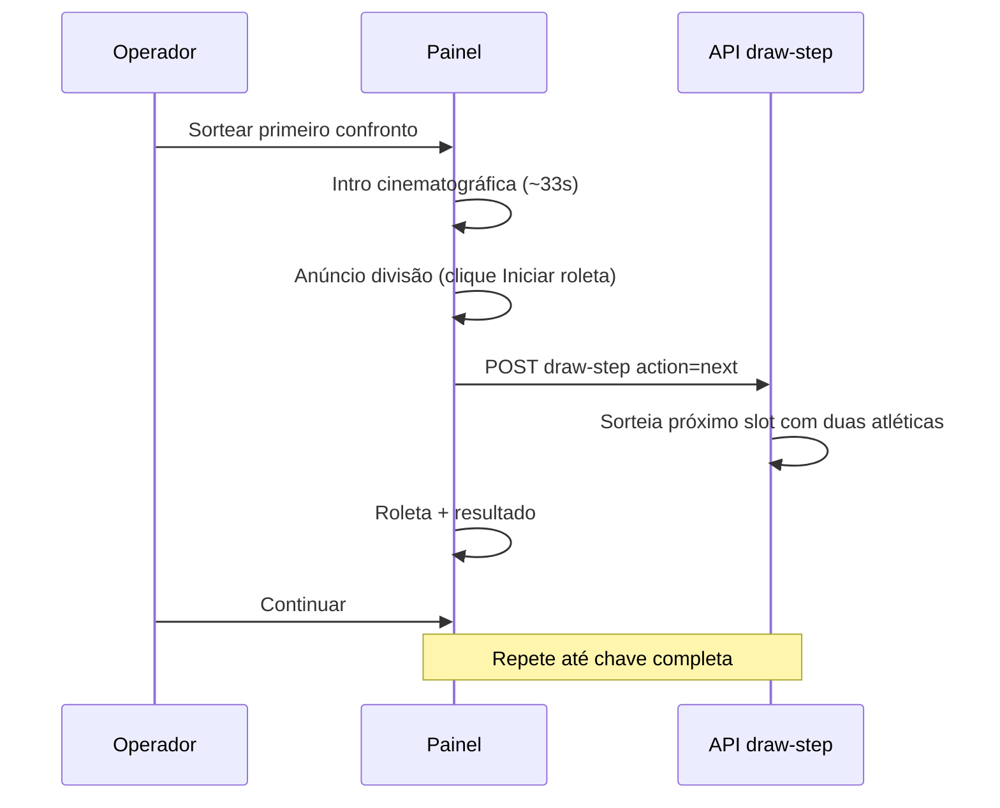

# Chaveamento mata-mata (Interunesp)

Documentação do sistema de chave eliminatória usado no painel **Sorteio da chave** (`/bracket`). Descreve a regra de negócio, o algoritmo, o fluxo de sorteio e onde isso está no código.

## Visão geral

- Cada **modalidade** (ex.: Basquete masculino) pode ter uma chave mata-mata publicada no bot.
- As atléticas vêm da lista global `ATLETICAS` (pacote `@chama/shared`), filtrada por **exclusões** da modalidade.
- Cada atlética pertence a uma **divisão** (`first` = 1ª divisão, `second` = 2ª divisão), definida no cadastro de divisões (`/api/admin/standings/divisions`).
- Com **duas divisões** na mesma modalidade, a chave é montada **por divisão**, em ordem: 1ª divisão completa → depois 2ª divisão.
- Os times são **embaralhados** antes de gerar o plano; a ordem na fila define quem enfrenta quem na primeira rodada.

O modelo segue o fluxo usado no evento: em cada rodada emparelha-se quem está na fila; se sobrar um participante (número ímpar), ele **aguarda** e entra na rodada seguinte. Confrontos futuros usam o texto **Vencedor confronto N** até as atléticas serem sorteadas.

## Conceitos

| Termo | Significado |
|--------|-------------|
| **Confronto** | Um jogo da chave, numerado `#1`, `#2`, … em `bracketInfo` |
| **Rodada** | Coluna da árvore: Oitavas, Quartas, Semifinal, Final (nome depende de quantos times) |
| **Plano** | Estrutura completa gerada em memória antes/durante o sorteio (`BracketPlan`) |
| **Slot real** | Confronto em que **duas atléticas** ainda serão sorteadas (`homeTeam` e `awayTeam` no plano) |
| **Placeholder** | Confronto só com *Vencedor confronto N* — criado automaticamente, sem roleta |
| **Folga de time** | Atlética que **não joga** na rodada atual e entra na **próxima** |
| **Folga de vencedor** | Classificado que **já venceu** um confronto e **aguarda** a rodada seguinte sem jogar |

## Algoritmo do plano (`planEliminationBracket`)

Implementação: `packages/shared/src/bracket-plan.ts`.

### Passo a passo

1. A fila inicial contém todas as atléticas da divisão (já embaralhadas).
2. Enquanto houver mais de um participante na fila:
   - Abre-se uma **rodada** (nome calculado pela profundidade até a final).
   - Percorre a fila de **dois em dois**:
     - **Par:** cria confronto, gera *Vencedor confronto N* para a próxima rodada.
     - **Ímpar (sobra um):**
       - Se for **time** → registra em `byeTeams` e coloca no **início** da fila da próxima rodada (joga na rodada seguinte, não folga de novo no fim).
       - Se for **vencedor** → registra em `byeWaitingConfrontos` e vai para o **fim** da fila da próxima rodada (aguarda mais uma rodada).
3. O número total de confrontos é a soma de jogos de todas as rodadas.

### Nomes das rodadas

Função `bracketRoundLabel`: a partir da quantidade de rodadas até a final, a última é **Final**, a anterior **Semifinal**, depois **Quartas**, depois **Oitavas**. Com muitas rodadas extras, usa **Jogo N**.

Isso é **rótulo visual**, não tamanho fixo de 16/8 times. Ex.: 10 times ainda podem ter coluna “Oitavas” com 5 jogos.

### Dois tipos de “sobra”



| Tipo | Quando ocorre | O que acontece |
|------|----------------|----------------|
| **Folga de time** | Número **ímpar de atléticas** na fila da rodada (ex.: 13 na 1ª rodada) | A atlética **pula essa rodada** e **joga na rodada seguinte** (ex.: folga nas oitavas → jogo nas quartas). |
| **Folga de vencedor** | Número **ímpar de classificados** após uma rodada (ex.: 7 vencedores das oitavas) | O vencedor do último confronto emparelhado **não joga a rodada seguinte**; o plano já reserva um confronto futuro com *Vencedor confronto N*. |

**Importante:** “Confronto ímpar” no texto do painel refere-se ao **número do confronto** que ficou esperando (ex.: confronto 7), não a “todo confronto de número ímpar”.

## Exemplos por quantidade de times

### 13 atléticas (ímpar na 1ª rodada)

- **Oitavas:** 6 jogos + **1 folga de time** (ex.: Ilha Solteira).
- A atlética com folga **não** aparece nas oitavas; entra **nas quartas** contra um vencedor.
- **Quartas → Semifinal → Final:** conforme a fila; podem surgir folgas de vencedor.

### 12 atléticas (par na 1ª rodada)

- **Oitavas:** 6 jogos, **ninguém** folga.
- **Quartas:** 3 jogos → 3 vencedores + 1 aguardando (**vencedor do confronto 6**).
- **Semifinal:** 1 jogo (dois vencedores das quartas).
- **Final:** vencedor da semi × vencedor que aguardou (confronto das oitavas #6).

### 14 atléticas — 1ª divisão (par na 1ª rodada)

- **Oitavas:** 7 jogos → 7 classificados.
- **Quartas:** 3 jogos → 3 vencedores; **vencedor do confronto 7** aguarda.
- **Semifinal:** 2 jogos; um deles é *Vencedor confronto 10 × Vencedor confronto 7*.
- **Final:** 1 jogo.

### 10 atléticas — 2ª divisão (par na 1ª rodada)

- **Oitavas:** 5 jogos → 5 classificados.
- **Quartas:** 2 jogos → 2 vencedores; **vencedor do confronto 5** aguarda.
- **Semifinal:** 1 jogo (outros dois vencedores); **o mesmo** vencedor do C5 **ainda aguarda**.
- **Final:** *Vencedor confronto 8 × Vencedor confronto 5* (o C5 pulou quartas e semifinal).

O painel pode repetir “vencedor do confronto 5” em duas frases — é **o mesmo classificado** das oitavas, não dois eventos distintos.

### 9 atléticas (ímpar na 1ª rodada)

- **Oitavas:** 4 jogos + 1 folga de time.
- A atlética com folga entra nas **quartas**.

## Sorteio no painel (fluxo operador)

Página: `apps/web/src/app/(admin)/bracket/page.tsx`  
Componentes: `BracketDrawArena`, `BracketDrawIntro`, `BracketTreeView`.



### Fases da interface

| Fase | Comportamento |
|------|----------------|
| **Intro** | Só no **primeiro** sorteio da modalidade; tempos em `BracketDrawIntro.tsx` (`INTRO_MS`). |
| **Anúncio** | Ao mudar de divisão; **só avança com** “Iniciar roleta” (sem timer automático). |
| **Roleta** | Mínimo ~3,2 s; sorteia par aleatório de atléticas **ainda não usadas** em confrontos reais. |
| **Resultado** | Mostra confronto sorteado. |

### O que o `draw-step` faz (`POST /api/admin/bracket/draw-step`)

1. Monta planos por divisão (`buildDivisionPlans`) com as mesmas regras do painel.
2. Encontra o **próximo confronto com duas atléticas** a sortear (ignora placeholders de *Vencedor confronto N*).
3. Sorteia par aleatório entre elegíveis livres e grava **apenas esse confronto** (`Confronto N · Time A × Time B`).
4. Ao completar todos os sorteios de atléticas da última divisão, **publica** a chave no bot (`bracketPublished`).

Confrontos de rodadas futuras (*Vencedor confronto N*) **não** são criados automaticamente no sorteio passo a passo — só quando você usar **Montar chave completa** ou cadastrar manualmente.

**Resortear:** só o último confronto com **duas atléticas** já definidas.

**Montar chave completa:** atalho explícito (com confirmação) que cria todos os confrontos de uma vez, incluindo placeholders.

## Confrontos manuais e exclusões

- **Exclusões:** atléticas marcadas não entram no sorteio nem no plano (`/api/admin/bracket/exclusions`).
- **Manuais:** confrontos criados à mão recebem o próximo número livre da chave (`backfillUnnumberedMatches`); não são sobrescritos pelo sorteio aleatório.
- **Mesma divisão:** confronto manual só entre atléticas da mesma divisão.

## API (admin)

| Método | Rota | Uso |
|--------|------|-----|
| `GET` | `/api/admin/bracket/eligibility?modalidadeId=` | Contagem e lista por divisão, folgas previstas, estrutura (mesma lógica do sorteio). |
| `GET` | `/api/admin/bracket/exclusions?modalidadeId=` | Atléticas excluídas. |
| `PUT` | `/api/admin/bracket/exclusions` | Salvar exclusões. |
| `POST` | `/api/admin/bracket/draw-step` | Próximo passo do sorteio (`action`: `next` ou `reshuffle`). |
| `POST` | `/api/admin/bracket/draw` | Sorteio completo / por fase. |
| `POST` | `/api/admin/bracket/reset` | Apagar chave da modalidade. |
| `PATCH` | `/api/admin/bracket/publish` | Publicar/despublicar no bot. |
| `GET` | `/api/admin/bracket/matches?modalidadeId=` | Partidas da chave. |

Corpo típico do `draw-step`:

```json
{
  "modalidadeId": "uuid",
  "teams": ["Atlética A", "..."],
  "action": "next"
}
```

`teams` deve ser a lista **elegível** (todas as atléticas menos excluídas), como o painel já envia.

## Validação e auditoria

- **Painel → Configurações → Elegibilidade por divisão (API):** dados do endpoint `eligibility`.
- **Avisos na arena:** `auditDivisionBracket` em `apps/web/src/lib/bracket-progress.ts` compara chave já salva com o plano (ex.: time com folga nas oitavas aparecendo em jogo; atlética na semifinal sem passar pelas quartas — chave antiga antes da correção da fila).

Se a chave foi montada com **regra antiga** (time com folga ia para o fim da fila e podia folgar duas vezes), **apague e sorteie de novo** ou corrija manualmente.

## Textos automáticos (`buildByeNote`)

Função: `packages/shared/src/bracket-plan.ts` → `buildByeNote(plan)`.

Gera frases por rodada, por exemplo:

- *Na Oitavas, X pula os confrontos e entra direto na Quartas.* (folga de **time**)
- *Na Quartas, o vencedor do confronto 7 aguarda sem jogar e entra direto na Semifinal.* (folga de **vencedor**)

## Onde está no código

| Área | Arquivo |
|------|---------|
| Plano da chave | `packages/shared/src/bracket-plan.ts` |
| Confrontos ocupados / próximo slot | `packages/shared/src/bracket-draw.ts` |
| Progresso e auditoria (web) | `apps/web/src/lib/bracket-progress.ts` |
| API sorteio | `apps/api/src/admin/admin-bracket.controller.ts` |
| Utilitários API | `apps/api/src/admin/bracket-draw.util.ts` |
| UI sorteio | `apps/web/src/app/(admin)/bracket/page.tsx` |
| Arena / árvore | `apps/web/src/components/bracket/*` |
| Intro | `apps/web/src/components/bracket/BracketDrawIntro.tsx` |
| Elegibilidade UI | `apps/web/src/components/bracket/BracketEligibilityPanel.tsx` |

## Ajuste de velocidade (intro e roleta)

Não há tela de configuração; valores no código:

| Efeito | Arquivo | Constantes |
|--------|---------|------------|
| Intro cinematográfica | `BracketDrawIntro.tsx` | `INTRO_MS`, `COUNTDOWN_STEP_MS`, `REDUCED_MS` |
| Roleta mínima | `bracket/page.tsx` | `3200` / `2400` ms |
| Troca de nomes na roleta | `BracketDrawArena.tsx` | `380` ms |

Com `prefers-reduced-motion: reduce`, a intro usa versão curta (`REDUCED_MS`).

## Perguntas frequentes

### Por que 14 times têm “Oitavas” com 7 jogos e não 8?

Porque o sistema **não exige** 16 times. O rótulo “Oitavas” indica a **primeira coluna** da chave, não “rodada de 16”. Com 14, todos jogam a primeira rodada (7 jogos).

### O vencedor que “aguarda” joga contra quem?

O plano já define o confronto futuro (ex.: *Vencedor confronto 10 × Vencedor confronto 7*). Ele só entra depois que os confrontos anteriores existem no banco (placeholders + resultados).

### Posso ter duas divisões na mesma modalidade?

Sim. Cada divisão tem plano e fila próprios; o sorteio termina a divisão ativa antes de passar à seguinte.

### A chave no bot é a mesma do painel?

Sim, após publicação (`bracketPublished`). Até lá, alterações ficam no admin.

### Formato no WhatsApp

Com dois times definidos, o bot mostra uma linha só, por exemplo:

`• Araçatuba x Presidente Prudente _(Confronto 2)_`

Placeholders usam `Confronto N · Vencedor confronto X × Vencedor confronto Y` (sem repetir o par). Implementação: `formatBracketMatchBotLine` em `apps/api/src/admin/match-display.util.ts`.

---

**Resumo:** chave = fila embaralhada + emparelhamento por rodada; sobra de **time** → joga na rodada seguinte (início da fila); sobra de **vencedor** → aguarda uma rodada; sorteio passo a passo preenche **somente** confrontos com duas atléticas; placeholders de vencedor só entram via **Montar chave completa** ou cadastro manual.
